```
Video upload Service have below functionalities
1. upload
2. trim
3. merge
4. share
5. Download
```


```Setup on local 
1. Without docker 
 a. Create virtaul environment 
    python -m venv venv
    pip install -r requirements.txt
 b. uncomment load dotenv in main.py 
 c. run command python app/main.py
```
```
2. With  docker 
 a. docker-compose build .
 b. docker-compose up 
```

```
Testing API (Go to swagger docs and execute them)
https://localhost:8000/docs
```

```
Upload Api
Endpoint :- POST
URL:- http://localhost:8000/upload/
```
Case 1 :- upload valid video

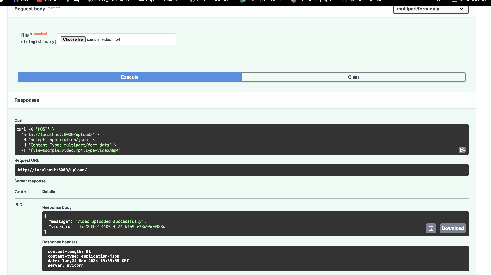

Case 2 :- Upload Video invalid > 25MB
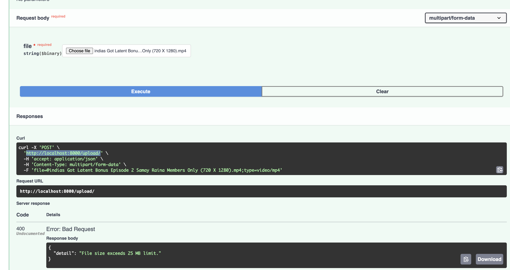

Case 3:- Upload video which are not in defined duration 

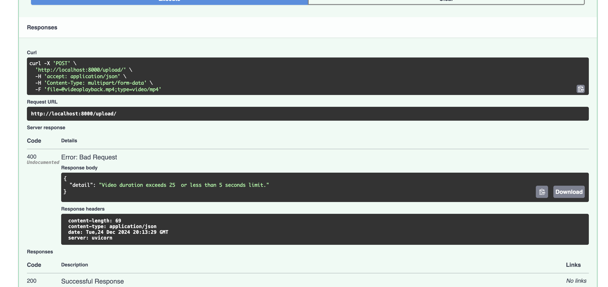

```
Trim API 
Endpoint :- http://localhost:8000/trim/{video-id}
Method:-  POST 
```
Case 1 :- Trim non existing video 
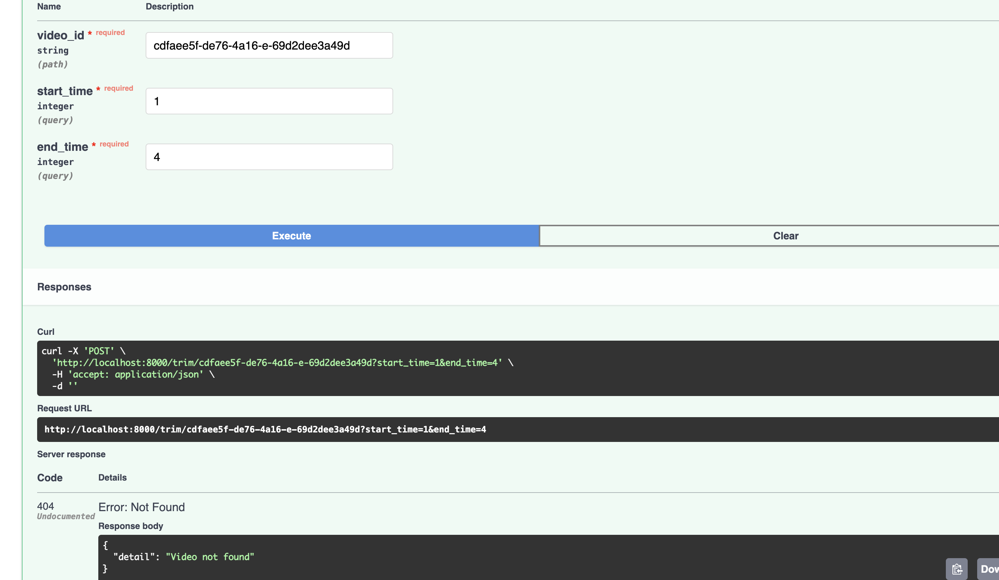

Case 2 :- Trim existing video

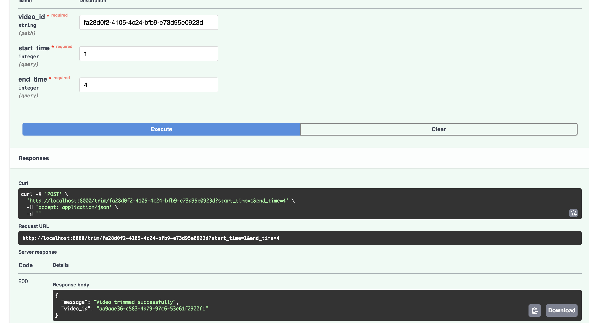


```
Merge API 
Endpoint :- http://localhost:8000/merge
Method:-  POST 
```
Case 1 :- Merge Video request with invalid videoid

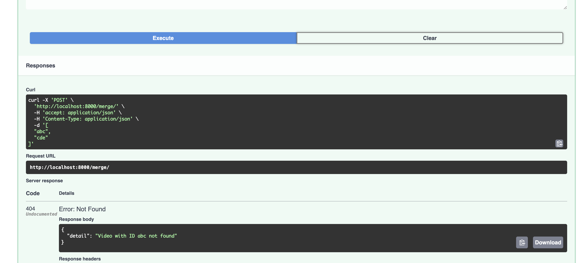

Case 2 :- Merge Video with valid video id
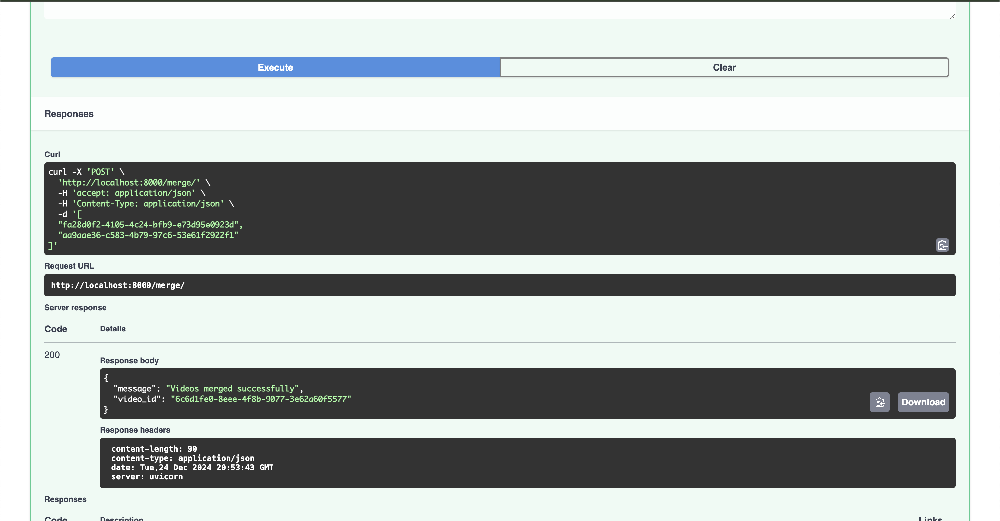


```
Share API 
Endpoint :- http://localhost:8000/share/{video-id}
Method:-  POST 
```
Case 1:- Share api with invalid videoid

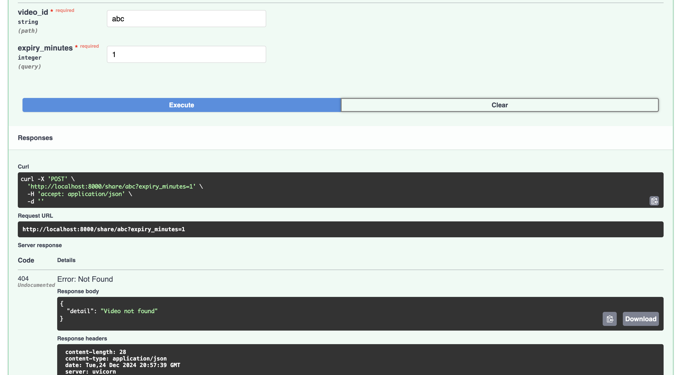

Case 2:- Share api with valid videoid

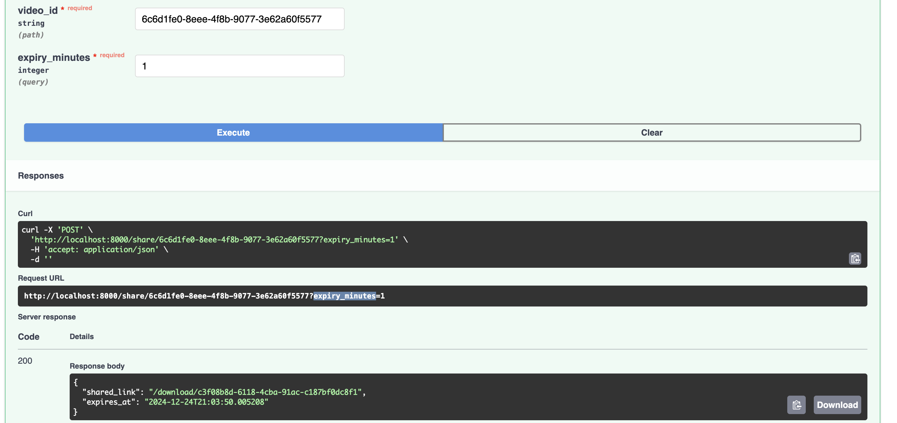

```
Download API 
Endpoint :- http://localhost:8000/download/{link-id}
Method:-  POST 
```
Case 1 :- Link is expired


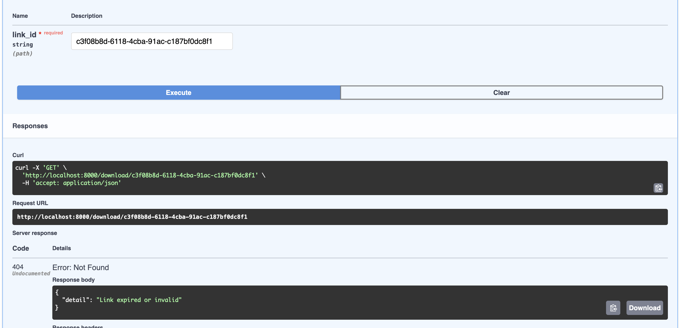

Case 2 :- Link is valid

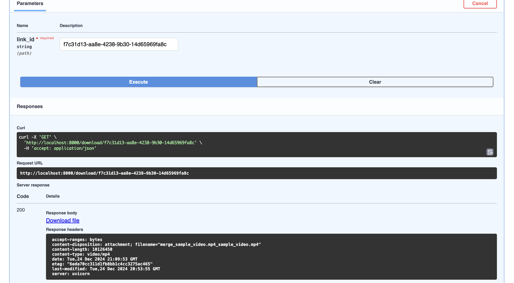

```
Run Unit test cases
Command : pytest --cov=app --cov-report=term-missing
Attach Report below 
```

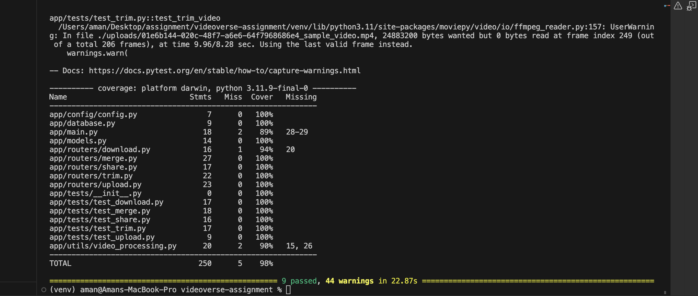
